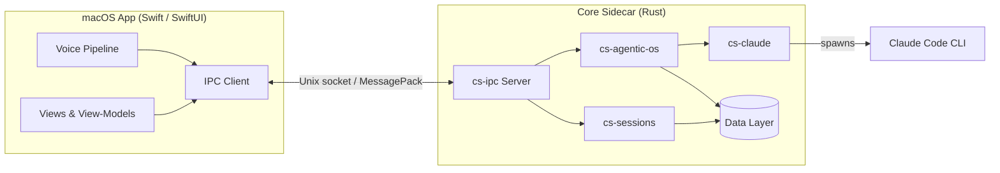
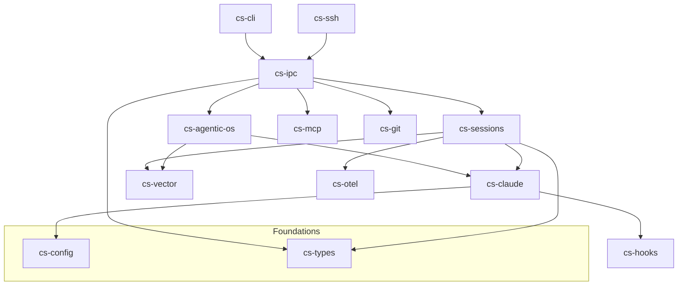
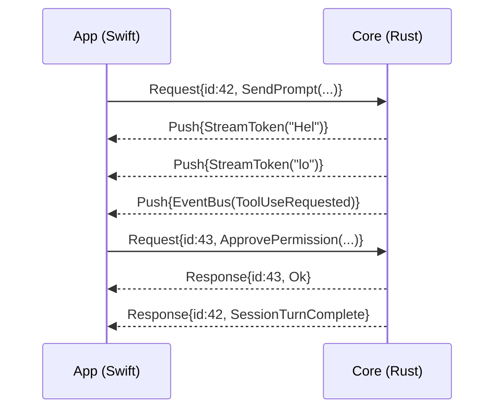
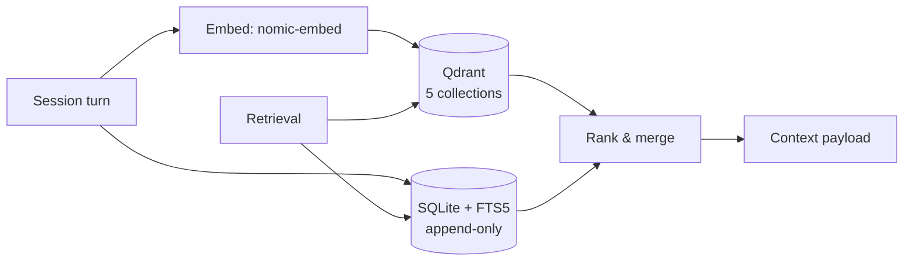
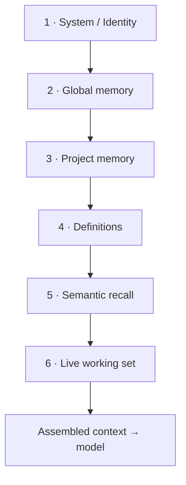

# ClaudeStudio — Architecture

> The deep technical reference for ClaudeStudio: a native macOS application that pairs a **SwiftUI** front-end with a **Rust** core sidecar to deliver a complete GUI and "Agentic OS" for Claude Code.

This document describes how the pieces fit together: the process model, the Rust crate topology, the IPC bridge, the data layer (Qdrant + SQLite), and the layered context-loading pipeline with its token budget.

---

## 1. Process model

ClaudeStudio runs as **two cooperating processes** on the same machine:

- **The App** — a SwiftUI/AppKit macOS application. It owns the window, the views, user input, and all rendering. It is intentionally "dumb": it holds no business logic that can't be re-derived from the core.
- **The Core** — a Rust sidecar binary (`claudestudio-core`) launched and supervised by the App. It owns *all* state, persistence, process management, the Agentic OS, and every integration (Claude Code CLI, MCP servers, git, OpenTelemetry, SSH).

They communicate over a local **Unix domain socket** using length-prefixed **MessagePack** frames. No business logic crosses into Swift; Swift renders a stream of view-models pushed by the core and sends back intents.

### Why two processes?

- **Stability** — a panic or runaway integration in Rust never takes down the UI; the App can restart the sidecar and replay state.
- **Concurrency** — the core runs a Tokio runtime for dozens of concurrent sessions, monitors, and MCP servers without blocking the main thread.
- **Reuse** — the same core powers the optional `cs-cli` headless binary and remote (SSH) execution.

---

## 2. Front-end — Swift / SwiftUI

| Concern | Approach |
| --- | --- |
| **Framework** | SwiftUI for layout and state, AppKit bridges (`NSViewRepresentable`) for terminal, diff, and graph rendering where SwiftUI is insufficient. |
| **State** | A single observable `AppStore` per window receives view-models from the core and publishes them; views are pure functions of that state. |
| **Navigation** | A persistent left sidebar (Projects, Sessions, Agentic OS, Brain, Tasks, Definitions, MCP, Settings) plus per-project tabs. |
| **Terminal** | A virtual-terminal view backed by the core's PTY stream; ANSI parsing happens in the core, the App renders glyph runs. |
| **Diff & Git** | Native side-by-side and inline diff views fed by `cs-git`. |
| **Brain View** | A GPU-accelerated force-directed graph (Metal/SwiftUI canvas) fed by the vector + relationship layer. |
| **Voice** | On-device STT/wake-word/TTS pipeline (see `docs/voice.md`); transcribed intents are sent over IPC like any other command. |

The App ships no embedded web view for core UI. The only HTML surfaces are optional rich previews.

---

## 3. Rust core — crate topology

The core is a Cargo workspace. Each crate has a single, well-bounded responsibility and depends "downward" only.

| Crate | Responsibility | Key dependencies |
| --- | --- | --- |
| **cs-types** | Shared domain types: sessions, projects, events, messages, view-models, errors. The vocabulary every other crate speaks. | `serde`, `uuid` |
| **cs-ipc** | The Unix-socket server, MessagePack framing, request/response + push-stream protocol, reconnection. | `tokio`, `rmp-serde`, `cs-types` |
| **cs-config** | Loads/merges configuration and the layered `CLAUDE.md` / `AGENTS.md` / definition files; watches for changes. | `serde`, `notify`, `cs-types` |
| **cs-sessions** | Lifecycle of Claude Code sessions: spawn, PTY, transcript capture, archive, resume. | `tokio`, `portable-pty`, `cs-claude`, `cs-vector` |
| **cs-vector** | Embeddings + Qdrant client; semantic memory write/read; SQLite FTS5 archive. | `qdrant-client`, `rusqlite`, embeddings backend |
| **cs-git** | Worktrees, branches, diffs, commits, deploy hooks. | `git2`, `cs-types` |
| **cs-agentic-os** | The Supervisor, Event-Bus, scheduler/priority queue, A2A routing, continuous-monitor agents, rule engine. | `tokio`, `cs-claude`, `cs-vector` |
| **cs-claude** | Wraps the Claude Code CLI / agent SDK: invocation, model routing, fallback chains, plan mode, permissions. | `tokio`, `cs-config` |
| **cs-mcp** | MCP server lifecycle, discovery, tool catalog, plugin registry. | `tokio`, `cs-types` |
| **cs-hooks** | Hook registry and execution (PreToolUse, PostToolUse, etc.); the secret scanner and prompt-injection guard hook into here. | `tokio`, `cs-config` |
| **cs-otel** | OpenTelemetry export, cost/token telemetry, traces and metrics. | `opentelemetry`, `tracing` |
| **cs-ssh** | Remote core/host execution over SSH for running sessions on another machine. | `russh`, `cs-ipc` |
| **cs-cli** | Headless binary exposing core capabilities for scripting/CI. | all of the above |

> **Status note.** `cs-types`, `cs-ipc`, `cs-config`, `cs-sessions`, `cs-claude`, and `cs-git` are foundational and targeted for the first milestone. `cs-agentic-os`, `cs-vector`, `cs-mcp`, `cs-hooks`, `cs-otel`, and `cs-ssh` are layered in across later phases (see `docs/roadmap.md`). Treat anything marked *planned* there as forward-looking.

---

## 4. The IPC bridge

The bridge between App and core is deliberately small and explicit.

### Transport

- **Unix domain socket** at a per-user path (e.g. `$XDG_RUNTIME_DIR`-equivalent under the app sandbox container). Local-only; never a TCP port.
- **Framing**: each message is a `u32` big-endian length prefix followed by a **MessagePack**-encoded body. MessagePack is chosen for compactness and zero-ambiguity round-tripping of the `cs-types` structs that both sides share (Swift uses a generated Codable mirror of the schema).

### Protocol shape

Three message kinds flow over the socket:

| Kind | Direction | Purpose |
| --- | --- | --- |
| **Request** | App → Core | An intent with a correlation id (e.g. *send prompt*, *create worktree*, *approve permission*). |
| **Response** | Core → App | The result (or error) for a correlation id. |
| **Push** | Core → App | Unsolicited streamed updates: token-by-token output, event-bus events, telemetry ticks, view-model deltas. |

The App reconnects automatically if the socket drops; the core keeps a durable event log so the App can resync view-models on reconnect.

---

## 5. Data layer

Two stores, with complementary guarantees.

### 5.1 Qdrant — semantic memory (5 collections)

Qdrant holds vector embeddings for semantic retrieval. Embeddings are produced by a **local `nomic-embed`** model by default, with a remote embedding API as a configurable fallback (see `docs/memory-and-vector.md`).

| # | Collection | What it stores | Typical query |
| --- | --- | --- | --- |
| 1 | `code_chunks` | Embedded source/code chunks per project. | "Where do we validate JWTs?" |
| 2 | `conversations` | Embedded turns from past sessions (the recall layer over the archive). | "Did we already debug this Tokio deadlock?" |
| 3 | `definitions` | The Definition Library (`.def.md`) entries. | "Inject the relevant domain definitions." |
| 4 | `documents` | Project docs, READMEs, specs, external references. | "What does the deploy runbook say?" |
| 5 | `cross_project` | Distilled, opt-in knowledge shared across all projects. | "How did I solve OAuth refresh in any project?" |

### 5.2 SQLite — durable archive (FTS5)

SQLite is the **source of truth for history**. Every session, message, event, tool call, and cost record is written here.

- **FTS5** full-text indexes power instant keyword search across the archive.
- **Guarantee: the archive is append-only and never deleted by the app.** Vector entries can be re-embedded or pruned; the SQLite record stays. This is the floor that semantic memory sits on top of.
- Privacy mode (see `docs/memory-and-vector.md`) can disable *vectorization* while still keeping the local archive — or, when stricter, keep neither.

---

## 6. The 6-layer context-loading pipeline

Before each Claude Code turn, `cs-config` + `cs-vector` assemble the context payload by walking six layers in a fixed order. Earlier layers are more authoritative and are protected from truncation; later layers fill the remaining budget and are the first to be trimmed.

| Layer | Source | Authority | Truncation policy |
| --- | --- | --- | --- |
| **1. System / Identity** | Core system prompt, trust mode, capabilities. | Highest — never trimmed. | Never |
| **2. Global memory** | Global `CLAUDE.md`, user-wide rules and preferences. | High. | Never |
| **3. Project memory** | Project `CLAUDE.md` / `AGENTS.md`, project rules. | High. | Rarely (summarized only at extreme overflow) |
| **4. Definitions** | Relevant `.def.md` entries injected from the `definitions` collection. | Medium-high. | Drop lowest-relevance first |
| **5. Semantic recall** | Top-k from Qdrant (`code_chunks`, `conversations`, `documents`, `cross_project`). | Medium. | k shrinks to fit |
| **6. Live working set** | Current files, diffs, active session transcript, tool outputs. | Contextual. | Oldest turns summarized/rolled |

### Token budget table

The default budget below is illustrative for a ~200K-token context window and is configurable per model in the Model Router. Layers 1–3 are reserved first; layers 4–6 compete for the remainder.

| Layer | Reserved share | Approx. tokens (200K window) | Behavior on overflow |
| --- | --- | --- | --- |
| 1 · System / Identity | ~2% | ~4,000 | Hard reserve |
| 2 · Global memory | ~3% | ~6,000 | Hard reserve |
| 3 · Project memory | ~7% | ~14,000 | Soft reserve; summarize last |
| 4 · Definitions | ~8% | ~16,000 | Relevance-pruned |
| 5 · Semantic recall | ~25% | ~50,000 | k auto-tuned |
| 6 · Live working set | remainder (~55%) | ~110,000 | Rolling summarization |

> The assembler always leaves headroom for the model's response. When the working set alone would exceed its share, `cs-sessions` performs rolling summarization of the oldest turns and writes the full fidelity copy to the SQLite archive so nothing is lost.

---

## 7. Cross-cutting concerns

- **Telemetry** (`cs-otel`) — every turn emits spans (tokens in/out, model, latency, cost) exported via OpenTelemetry and surfaced in the Cost/Telemetry view.
- **Security** (`cs-hooks`) — trust modes, permission gates, the secret scanner, and the prompt-injection guard are enforced in the core, not the UI, so they hold even for headless/CLI and remote runs. See `docs/security.md`.
- **Remote** (`cs-ssh`) — a core instance can drive a session on another host; the local App talks to the local core, which proxies to the remote core over SSH.

---

## See also

- [docs/README.md](docs/README.md) — documentation index
- [docs/getting-started.md](docs/getting-started.md) — build & first run
- [docs/agentic-os.md](docs/agentic-os.md) — Supervisor & Event-Bus
- [docs/context-system.md](docs/context-system.md) — context & definitions
- [docs/memory-and-vector.md](docs/memory-and-vector.md) — Qdrant & SQLite
