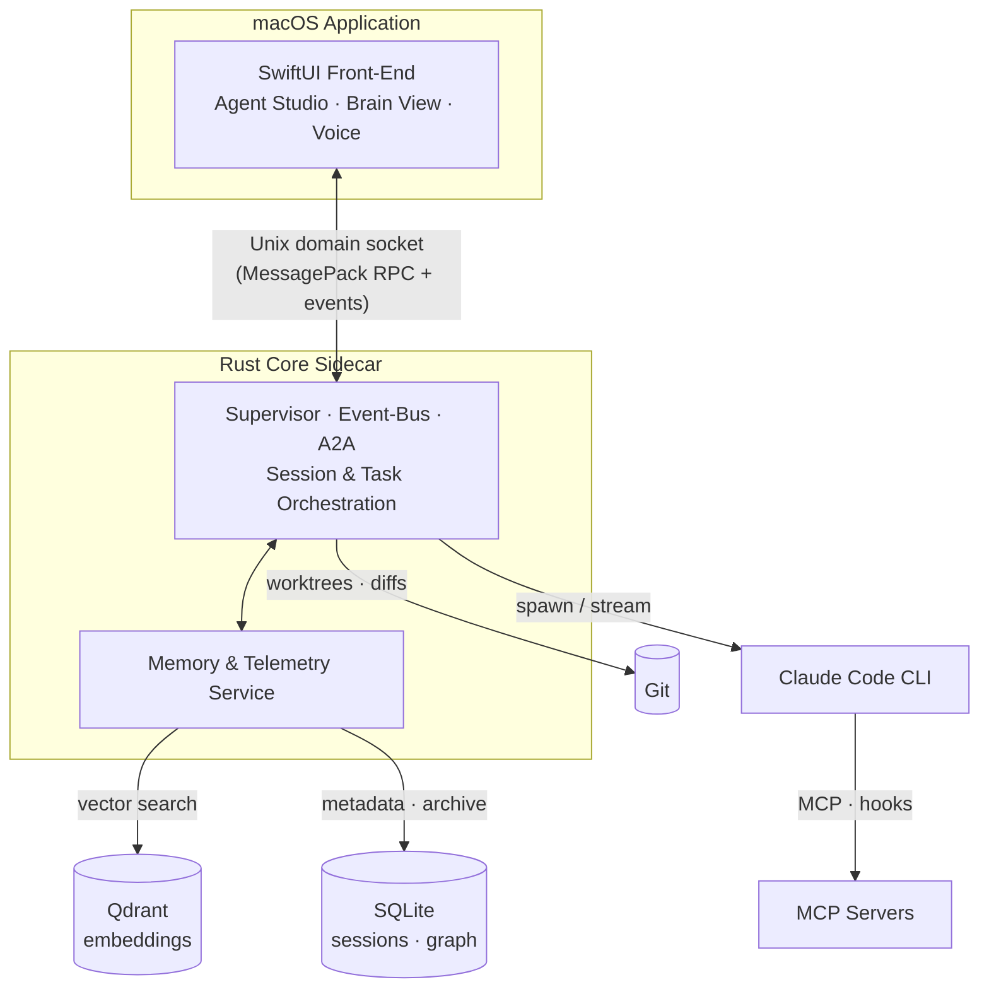

<div align="center">

```
 ██████╗██╗      █████╗ ██╗   ██╗██████╗ ███████╗
██╔════╝██║     ██╔══██╗██║   ██║██╔══██╗██╔════╝
██║     ██║     ███████║██║   ██║██║  ██║█████╗
██║     ██║     ██╔══██║██║   ██║██║  ██║██╔══╝
╚██████╗███████╗██║  ██║╚██████╔╝██████╔╝███████╗
 ╚═════╝╚══════╝╚═╝  ╚═╝ ╚═════╝ ╚═════╝ ╚══════╝
        ███████╗████████╗██╗   ██╗██████╗ ██╗ ██████╗
        ██╔════╝╚══██╔══╝██║   ██║██╔══██╗██║██╔═══██╗
        ███████╗   ██║   ██║   ██║██║  ██║██║██║   ██║
        ╚════██║   ██║   ██║   ██║██║  ██║██║██║   ██║
        ███████║   ██║   ╚██████╔╝██████╔╝██║╚██████╔╝
        ╚══════╝   ╚═╝    ╚═════╝ ╚═════╝ ╚═╝ ╚═════╝
```

### **A native macOS GUI and Agentic OS for Claude Code**

*Every Claude Code capability in a real Mac app — with permanent semantic memory, a multi-agent supervisor, and a knowledge-graph Brain View.*

<br />

[](https://github.com/vqiz/ClaudeStudio/actions)
[](https://github.com/vqiz/ClaudeStudio/blob/main/LICENSE)
[](https://github.com/vqiz/ClaudeStudio)
[](https://swift.org)
[](https://www.rust-lang.org)
[](https://github.com/vqiz/ClaudeStudio/blob/main/CONTRIBUTING.md)
[](https://github.com/vqiz/ClaudeStudio/stargazers)

<br />

**[Features](#-feature-highlights)** · **[Architecture](#-architecture)** · **[Quickstart](#-quickstart)** · **[Roadmap](#-roadmap)** · **[Contributing](#-contributing--community)**

</div>

<br />

> [!WARNING]
> **Project status: pre-alpha scaffold.** ClaudeStudio is in early, active development. The architecture and vision below describe where the project is heading — many features are partially implemented or still on the drawing board. Expect breaking changes, rough edges, and missing pieces. This is **not** production-ready. Stars, issues, and PRs are hugely appreciated as we build toward the first milestone.

<br />

## Why ClaudeStudio?

The Claude Code CLI is extraordinarily powerful, but it lives in a terminal — and it forgets. ClaudeStudio fixes both.

- **No hidden knowledge required.** Worktrees, hooks, skills, MCP servers, `AGENTS.md`, plan mode, permissions — every advanced Claude Code capability is surfaced through a discoverable, native UI. You don't have to memorize flags or hand-edit config to use the good parts.
- **Permanent semantic memory.** Conversations, decisions, and artifacts are archived and embedded (Qdrant + SQLite) so Claude can recall what happened last week — or last month — instead of starting cold every session.
- **A real Agentic OS, not a wrapper.** A Supervisor, an Event-Bus, and agent-to-agent (A2A) messaging let multiple agents collaborate on long-running work. ClaudeStudio is built as an operating layer for agents, not a chat box bolted onto a binary.

<br />

## ✨ Feature Highlights

#### 🧑‍🚀 Agent Studio & Teams
Compose, configure, and save individual agents — then assemble them into **Teams** that tackle a goal together. Each agent carries its own role, tools, permissions, and memory scope.

#### 🧠 Agentic OS (Supervisor · Event-Bus · A2A)
A **Supervisor** plans and delegates, an **Event-Bus** fans work out and collects results, and **agent-to-agent (A2A)** messaging lets agents hand off, request help, and negotiate — the backbone for durable, multi-step automation.

#### 🗂️ Permanent Session Archive
Every session is captured and replayable. Nothing is lost when a window closes — browse, search, and resume past work with full context.

#### 🔎 Semantic Memory (Qdrant + SQLite)
Vector search over your history (Qdrant) plus structured metadata and relationships (SQLite). Claude retrieves the *relevant* past, not just the recent past.

#### 🕸️ Brain View — Knowledge Graph
A live, navigable graph of entities, files, decisions, and their relationships across all your sessions. See *how* your project's knowledge connects, not just *what* was said.

#### 🎙️ Voice Assistant
Talk to your agents. Dictate tasks, get spoken status, and drive workflows hands-free.

#### 📚 Definition Library
Reusable building blocks — agent definitions, skills, hooks, and prompts — versioned and shareable so your best setups become first-class assets.

#### ⚡ Task Library — One-Click Workflows
Curated, parameterized workflows you can run in a click — including **DE/AT compliance** tasks (e.g. GDPR/DSGVO-aware routines) tuned for German and Austrian requirements.

#### 🔌 MCP & Hooks Managers
Discover, install, configure, and toggle **MCP servers** and lifecycle **hooks** from a UI — no manual JSON surgery, with validation and live status.

#### 💰 Cost & Telemetry
Real-time token, request, and spend tracking per session, agent, and team — so the meter is never a surprise.

#### 🛡️ Trust Modes & Permissions
Granular permission control with **trust modes** — from fully sandboxed read-only to auto-approved trusted workspaces — mapped directly onto Claude Code's permission model.

<br />

## 🏗️ Architecture

ClaudeStudio is a **native SwiftUI front-end** talking to a **Rust core sidecar** over a local Unix domain socket using MessagePack framing. The Rust core owns all the heavy lifting — orchestration, memory, persistence, and process management — and drives the Claude Code CLI.



**Why a Swift + Rust split?** SwiftUI gives a truly native, low-latency Mac UI with system integration (menu bar, notifications, accessibility, voice). Rust gives a fast, memory-safe, single-binary core for concurrency-heavy orchestration and embeddings — no Node runtime, no Electron, no browser engine shipped inside the app.

<br />

## ⚖️ How It Compares

|                              | **ClaudeStudio**                          | Raw Claude Code CLI            | Generic Electron wrapper        |
| ---------------------------- | ----------------------------------------- | ------------------------------ | ------------------------------- |
| **Idle RAM footprint**       | Low — native SwiftUI + Rust binary        | Minimal (terminal only)        | High — bundled Chromium runtime |
| **Cold startup**             | Fast (native app launch)                  | Instant (in your shell)        | Slow (boot a browser engine)    |
| **Native macOS feel**        | ✅ First-class SwiftUI, menus, voice       | ⌨️ Terminal UX only            | ⚠️ Web UI in a window           |
| **Permanent semantic memory**| ✅ Qdrant + SQLite, cross-session recall   | ❌ Stateless per session        | ❌ Usually none                  |
| **Agentic OS (multi-agent)** | ✅ Supervisor · Event-Bus · A2A            | ➖ Single agent, manual         | ➖ Typically a single chat       |
| **Knowledge-graph view**     | ✅ Brain View                              | ❌                              | ❌                               |
| **Surfaces full CC feature set** | ✅ Hooks, MCP, worktrees, skills, plan mode | ✅ (via flags/config)           | ⚠️ Partial, varies              |

> Comparisons describe the design intent and target characteristics. Numbers are not yet benchmarked — see [Project status](#) above.

<br />

## 🚀 Quickstart

### Prerequisites

- **macOS 14 (Sonoma) or newer**
- **[Claude Code CLI](https://docs.anthropic.com/en/docs/claude-code)** installed and authenticated (`claude --version`)
- **Rust** (stable) via [rustup](https://rustup.rs) — `rustc --version`
- **Swift 6** toolchain (Xcode 16+ or the Swift 6 toolchain) — `swift --version`

### 1. Clone

```bash
git clone https://github.com/vqiz/ClaudeStudio.git
cd ClaudeStudio
```

### 2. Build the Rust core

```bash
cd core
cargo build --release
```

### 3. Run the core sidecar

```bash
cargo run --release
# The core listens on a local Unix domain socket and waits for the app to connect.
```

### 4. Build & run the macOS app

In a second terminal, from the repo root:

```bash
cd app
swift run ClaudeStudio
```

The app will connect to the running core, detect your Claude Code CLI, and open the workspace.

> First run? Open **Settings → MCP & Hooks** to point ClaudeStudio at your existing MCP servers, and **Settings → Trust** to pick a default permission mode.

<br />

## 🗂️ Repository Layout

```
ClaudeStudio/
├── core/            # Rust core sidecar — Supervisor, Event-Bus, memory, RPC
├── app/             # SwiftUI macOS application (front-end)
├── docs/            # Architecture, roadmap, and design docs
├── tasks/           # Task Library — one-click workflow definitions (incl. DE/AT compliance)
├── definitions/     # Definition Library — agents, skills, hooks, prompts
└── .github/         # CI workflows, issue/PR templates, community health files
```

<br />

## 🗺️ Roadmap

ClaudeStudio is being built in four phases. Full detail lives in **[docs/roadmap.md](docs/roadmap.md)**.

| Phase | Theme | Highlights |
| ----- | ----- | ---------- |
| **1 — Foundation** | The native shell | Swift ⇄ Rust socket bridge, Claude CLI integration, session UI, permissions/trust modes |
| **2 — Memory** | Never start cold | Permanent session archive, Qdrant + SQLite semantic memory, Brain View knowledge graph |
| **3 — Agentic OS** | Agents that collaborate | Supervisor, Event-Bus, A2A messaging, Agent Studio & Teams |
| **4 — Ecosystem** | Power & polish | Voice Assistant, Definition & Task Libraries, MCP/Hooks managers, Cost & Telemetry |

> We are currently in **Phase 1**. Phases overlap and may reorder as we learn — follow the [milestones](https://github.com/vqiz/ClaudeStudio/milestones) for the live picture.

<br />

## 🤝 Contributing & Community

Contributions of every size are welcome — code, docs, design, bug reports, and ideas.

- Read the **[Contributing Guide](CONTRIBUTING.md)** to get set up and learn the workflow.
- Be excellent to each other: see our **[Code of Conduct](CODE_OF_CONDUCT.md)**.
- New here? Look for **[good first issues](https://github.com/vqiz/ClaudeStudio/issues?q=is%3Aissue+is%3Aopen+label%3A%22good+first+issue%22)** to find an easy on-ramp.
- Have a question or a wild idea? Open a **[Discussion](https://github.com/vqiz/ClaudeStudio/discussions)** or **[Issue](https://github.com/vqiz/ClaudeStudio/issues)**.

If ClaudeStudio is useful to you, the most valuable thing you can do is **⭐ star the repo** — it genuinely helps the project grow.

### 💜 Sponsors

This is an independent, MIT-licensed open-source project. Sponsorship helps fund maintenance and new features — if you'd like to support development, watch this space (and the repo's **Sponsor** button once enabled).

<br />

## 📄 License

ClaudeStudio is released under the **[MIT License](LICENSE)**. Use it, fork it, build on it.

<br />

<div align="center">

**Built with [Claude Code](https://docs.anthropic.com/en/docs/claude-code).** 🤖

*ClaudeStudio is an independent open-source project and is not affiliated with or endorsed by Anthropic.*

</div>
