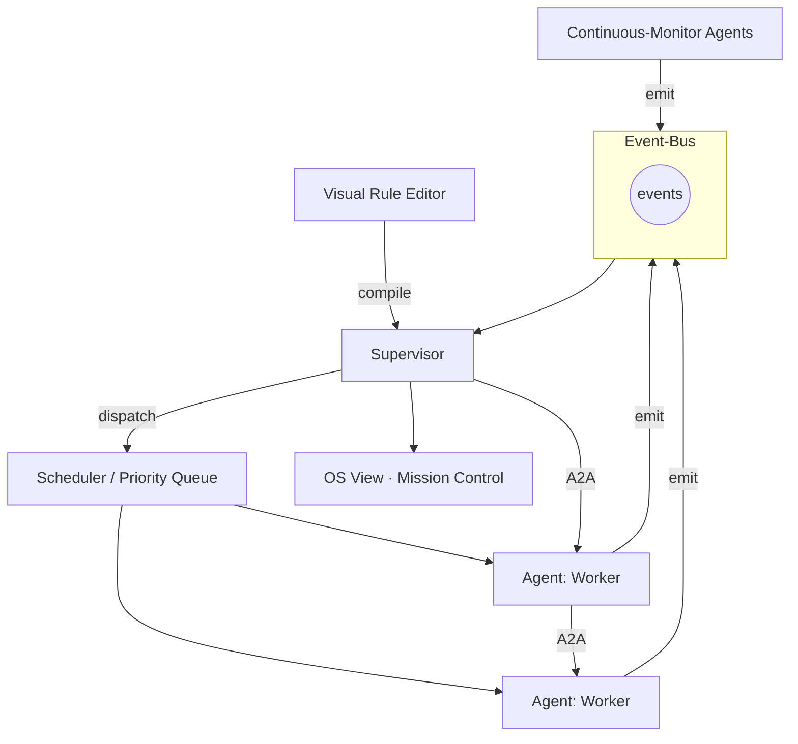
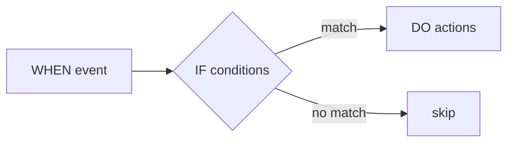

# Agentic OS

The **Agentic OS** is the layer that turns ClaudeStudio from a chat front-end into an operating system for autonomous work. It lives in the `cs-agentic-os` crate and coordinates many agents, monitors, and scheduled jobs around a central **Event-Bus** and a **Supervisor**.

> **Status.** The Agentic OS is a Phase 2–3 capability (see [roadmap.md](roadmap.md)). The Supervisor, Event-Bus, and scheduler form the implemented foundation; continuous-monitor agents and the visual rule editor are progressively landing. Items below are marked where relevant.

---

## 1. The big picture

Everything that happens — a tool call, a file change, a finished session, a cost threshold crossed — becomes an **event**. The Supervisor reacts to events according to **rules**, scheduling agents through a **priority queue**. Agents talk to each other over **A2A**. The whole system is observable in the **OS View**.

---

## 2. The Supervisor

The Supervisor is the orchestrator. It:

- **Subscribes** to the Event-Bus and matches incoming events against active rules.
- **Schedules** work by enqueuing agent invocations into the priority queue.
- **Owns lifecycles** — starting, pausing, retrying, and tearing down agents and monitors.
- **Enforces budgets** — respects cost/token ceilings (via `cs-otel`) and trust-mode gates (via `cs-hooks`) before dispatching anything.
- **Mediates A2A** — routes agent-to-agent messages and prevents loops.

The Supervisor is conservative by default: nothing autonomous runs unless a rule authorizes it and the active trust mode permits it (see [security.md](security.md)).

---

## 3. The Event-Bus

A typed, in-process publish/subscribe bus. Every meaningful state change is an event; subscribers (Supervisor, monitors, the OS View, telemetry) react.

### Event types

| Event | Emitted when | Typical reactions |
| --- | --- | --- |
| `SessionStarted` | A Claude Code session begins. | Telemetry start; monitor attach. |
| `SessionEnded` | A session finishes or is archived. | Embed transcript; summarize; emit insights. |
| `ToolUseRequested` | An agent wants to run a tool. | Permission gate; secret/injection scan. |
| `ToolUseCompleted` | A tool call returns. | Audit log; downstream rule triggers. |
| `FileChanged` | A watched file is modified. | Re-index; lint monitor; test monitor. |
| `GitEvent` | Commit, branch, merge, push. | Deploy hook; review agent. |
| `CostThresholdCrossed` | Token/cost ceiling reached. | Throttle; notify; pause queue. |
| `PermissionRequested` | A gated action needs approval. | Prompt user; auto-approve per rule. |
| `MonitorAlert` | A continuous monitor detects a condition. | Spawn a remediation task. |
| `TaskScheduled` / `TaskCompleted` | A scheduled task enters/leaves the queue. | Chain follow-ups; notify. |
| `AgentMessage` | An A2A message is sent. | Route to target agent. |
| `RuleTriggered` | A rule's condition matches. | Execute the rule's action. |

Events are also persisted to the SQLite archive, so the OS View timeline and the audit log are replayable.

---

## 4. Agent-to-Agent (A2A)

Agents are not islands. **A2A** lets one agent hand off to or request something from another through the Supervisor, which:

- validates the target agent exists and is permitted to run,
- attaches the relevant context (see [context-system.md](context-system.md)),
- prevents cycles with depth limits and loop detection,
- records the exchange as `AgentMessage` events.

This is the substrate for **Agent Teams** — an orchestrator agent fanning work out to workers and collecting results (see [agents.md](agents.md#agent-teams)).

---

## 5. Scheduler & priority queue

Work doesn't run immediately; it's enqueued and scheduled.

| Concept | Description |
| --- | --- |
| **Priority queue** | Higher-priority work (e.g. a user-initiated action, a security alert) preempts background work. |
| **Concurrency limits** | Caps on simultaneous agents/sessions to protect machine resources and API budgets. |
| **Backoff & retry** | Failed jobs retry with exponential backoff up to a per-rule limit. |
| **Budget-aware admission** | The queue refuses to admit work that would breach a cost/token ceiling. |
| **Cron / time triggers** | Time-based jobs (nightly review, weekly digest) are scheduled here. |

---

## 6. Continuous-monitor agents

Long-lived agents that watch for conditions and emit `MonitorAlert` events rather than running a one-shot turn. **(progressively landing)**

Examples:

- **Test monitor** — on `FileChanged`, runs the affected tests and alerts on regressions.
- **Lint/type monitor** — keeps a project clean and proposes fixes.
- **Dependency monitor** — flags outdated or vulnerable dependencies.
- **Cost monitor** — watches spend and throttles or notifies.
- **Drift monitor** — detects when code diverges from its documented definitions.

Monitors are themselves governed by the Supervisor and trust mode; an alert can *propose* a remediation task, but whether it runs autonomously is a rule + trust-mode decision.

---

## 7. OS View — mission control

The **OS View** is the cockpit. It surfaces the live state of the Agentic OS:

- **Event timeline** — a streaming, filterable feed of every event.
- **Active agents & monitors** — what's running, on what, with what budget.
- **Queue** — pending and in-flight work with priorities.
- **Rules** — which rules are armed and which fired recently.
- **Budgets & telemetry** — token/cost burn-down (from `cs-otel`).
- **Controls** — pause/resume the queue, kill a runaway agent, approve gated actions.

---

## 8. The visual rule editor

Rules are the policy that drives autonomy. The **visual rule editor** lets you compose them without writing code, in a **when → if → do** shape. **(planned)**

| Part | Examples |
| --- | --- |
| **WHEN** (trigger) | `FileChanged`, `GitEvent(push)`, `CostThresholdCrossed`, a cron schedule. |
| **IF** (conditions) | path globs, branch name, trust mode, time of day, budget remaining. |
| **DO** (actions) | run an agent, spawn a task, request approval, notify, throttle the queue. |

Example rule, in plain language:

> **WHEN** a push lands on `main` **IF** trust mode is at least Standard **DO** run the *Review* agent and post results to the OS View.

Compiled rules are handed to the Supervisor, which arms them against the Event-Bus.

---

## See also

- [Agents](agents.md) — designing the agents the Supervisor schedules.
- [Tasks & Definitions](tasks-and-definitions.md) — scheduled, reusable units of work.
- [Security](security.md) — the gates every autonomous action passes through.
- [ARCHITECTURE.md](../ARCHITECTURE.md) — where `cs-agentic-os` sits in the crate graph.
