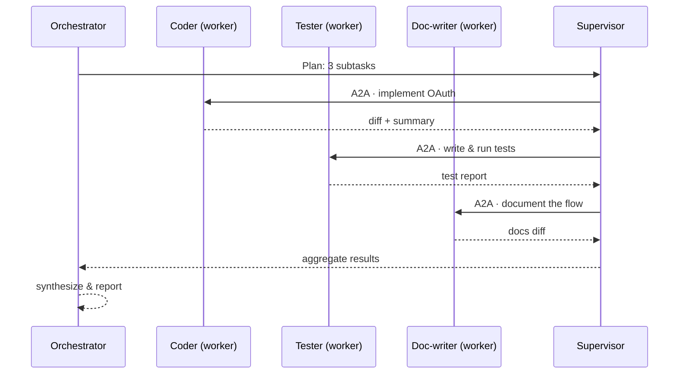
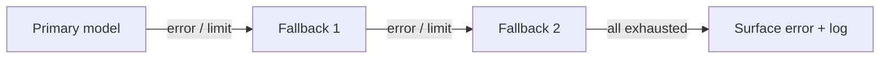

# Agents

ClaudeStudio lets you design, compose, and route custom agents. The **Agent Studio** is the visual designer; **Agent Teams** let an orchestrator coordinate workers; the **Model Router** and **fallback chain** decide which model actually runs each turn. Agents are driven by `cs-claude` and scheduled by the Agentic OS (`cs-agentic-os`).

> **Status.** The Agent Studio designer and Model Router are core features; multi-agent Teams build on the Agentic OS Supervisor and A2A (Phase 2–3, see [roadmap.md](roadmap.md)).

---

## 1. Agent Studio — the designer

An **agent** is a reusable, named configuration of behavior. The Agent Studio exposes the following fields:

| Field | Purpose |
| --- | --- |
| **Name** | Stable identifier and display label. |
| **Description** | What the agent is for; shown in pickers and the OS View. |
| **System prompt / role** | The agent's instructions and persona. |
| **Model** | Preferred model, or "let the Router decide." |
| **Tools / permissions** | Which tools the agent may use and at what trust level (see [security.md](security.md)). |
| **Context policy** | Which definitions/collections it pulls (see [context-system.md](context-system.md)). |
| **Inputs** | Declared parameters (e.g. a target path, a ticket id). |
| **Outputs** | Expected result shape (text, diff, structured JSON). |
| **Budget** | Per-invocation token/cost ceiling. |
| **Trigger** | Manual, A2A-callable, or rule/event-driven (see [agentic-os.md](agentic-os.md#8-the-visual-rule-editor)). |
| **Fallback** | The fallback chain to use if the primary model fails. |

Agents are versioned and can be shared across projects.

---

## 2. Agent Teams

A **team** is an **orchestrator** agent plus one or more **worker** agents. The orchestrator decomposes a goal, dispatches subtasks to workers over A2A, and synthesizes their results — all mediated by the Supervisor.

### Example flow

> Goal: *"Add OAuth login and document it."*

The Supervisor enforces budgets, permissions, and loop limits on every A2A hop, and writes each exchange to the Event-Bus and archive for the OS View timeline.

---

## 3. Model Router

The Model Router picks the right model per turn based on the agent's preference and the task's characteristics, then enforces budgets and the fallback chain.

| Routing input | Effect |
| --- | --- |
| **Agent preference** | An explicit model wins unless overridden by budget rules. |
| **Task complexity** | Heuristics (long context, planning, tool-heavy) bias toward stronger models. |
| **Cost/latency target** | A speed- or cost-priority hint biases toward faster/cheaper models. |
| **Context size** | The required window must fit the model's limit (see the [budget table](../ARCHITECTURE.md#token-budget-table)). |
| **Trust mode** | Some autonomous flows restrict which models may run unattended. |

Illustrative routing table (configure per your available models):

| Task profile | Primary | Notes |
| --- | --- | --- |
| Deep reasoning / planning | Most-capable tier | Used for plan mode and orchestration. |
| Everyday coding | Balanced tier | The default workhorse. |
| Quick edits / classification | Fast tier | Low latency, low cost. |
| Embeddings | `nomic-embed` (local) | Handled by `cs-vector`, not the chat router. |

---

## 4. Fallback chain

If the chosen model fails — rate limit, timeout, error, or budget exhaustion — the router walks an ordered **fallback chain** instead of failing the turn.

| Step | Behavior |
| --- | --- |
| **Primary** | The router's first choice. |
| **Fallback 1..N** | Tried in order; each can be a different tier or provider. |
| **Exhausted** | If every link fails, the turn errors cleanly, the event is logged to telemetry, and the partial state is preserved in the archive. |

Fallback decisions are recorded as telemetry events (`cs-otel`) so you can see how often and why a fallback fired.

---

## See also

- [Agentic OS](agentic-os.md) — the Supervisor, A2A, and scheduling that power Teams.
- [Context System](context-system.md) — the context policy agents draw from.
- [Security](security.md) — per-agent permissions and trust modes.
