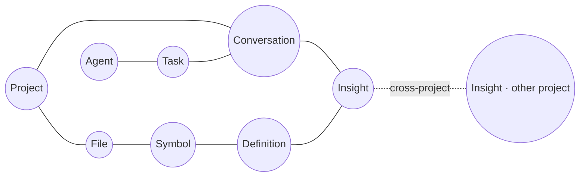

# Brain View

The **Brain View** is ClaudeStudio's knowledge-graph visualization — an interactive map of everything the system knows about your work: code, conversations, definitions, documents, agents, and the relationships between them. It renders the contents of the memory layer (`cs-vector` + the SQLite relationship records) as a living graph.

> **Status.** The Brain View is a Phase 3 (Intelligence) feature; node/edge taxonomy below is the target model. See [roadmap.md](roadmap.md).

---

## 1. What it shows

Every node is a thing the system has stored or learned; every edge is a relationship discovered from structure (imports, file membership) or from semantic similarity (recall links).

---

## 2. Node types

| Node | Represents | Backed by |
| --- | --- | --- |
| **Project** | A registered repository. | `cs-config` |
| **File** | A source or doc file. | `code_chunks` / `documents` |
| **Symbol** | A function, type, or module. | Code indexing |
| **Definition** | A `.def.md` entry. | `definitions` collection |
| **Conversation** | A past session / turn cluster. | `conversations` collection + archive |
| **Insight** | A distilled lesson or summary. | `cross_project` collection |
| **Agent** | A designed agent (see [agents.md](agents.md)). | Agent Studio |
| **Task** | A reusable unit of work (see [tasks-and-definitions.md](tasks-and-definitions.md)). | `/tasks` |
| **Document** | A spec, README, or reference. | `documents` collection |

---

## 3. Edge types

| Edge | Meaning |
| --- | --- |
| **contains** | Project → File → Symbol structural membership. |
| **references** | One file/symbol uses another (imports, calls). |
| **defines / governed-by** | A Symbol or File is governed by a Definition. |
| **discussed-in** | A File/Symbol/Definition was the subject of a Conversation. |
| **derived-from** | An Insight was distilled from one or more Conversations. |
| **related-to** | A semantic-similarity link (the recall graph). |
| **produced-by** | A Task/diff was produced by an Agent. |
| **cross-project** | Links insights/definitions across project boundaries (opt-in). |

Edges carry weights (structural certainty or similarity score), which drive layout and filtering.

---

## 4. The graph UI

- **Force-directed layout** — clusters form naturally around tightly related nodes; GPU-accelerated for large graphs.
- **Filter & focus** — show/hide by node type, project, recency, or edge weight; double-click a node to focus its neighborhood.
- **Search** — jump to any node by name; hybrid keyword + semantic search (see [memory-and-vector.md](memory-and-vector.md#4-the-retrieval-pipeline)).
- **Inspect** — select a node to see its payload, source, and links; jump straight into the file, conversation, or definition.
- **Time scrubbing** — replay how the graph grew as sessions accumulated (built on the append-only archive).
- **Live updates** — new nodes/edges animate in as sessions run and files change (driven by Event-Bus `FileChanged` / `SessionEnded` events).

---

## 5. Use cases

| Goal | How the Brain View helps |
| --- | --- |
| **Onboard to a codebase** | See the structural map and which areas have the most discussion/definitions. |
| **Find prior art** | Follow `related-to` and `discussed-in` edges to past work on a topic. |
| **Spot knowledge gaps** | Files with no governing definitions or no discussion stand out as isolated nodes. |
| **Trace a decision** | `derived-from` edges connect an Insight back to the conversations that produced it. |
| **Audit an agent's work** | `produced-by` edges show what each agent touched. |
| **Cross-project transfer** | `cross-project` edges reveal reusable insights from other repos. |

---

## See also

- [Memory & Vector](memory-and-vector.md) — the data behind the graph.
- [Context System](context-system.md) — definitions as first-class nodes.
- [Agents](agents.md) — agents and the tasks they produce.
