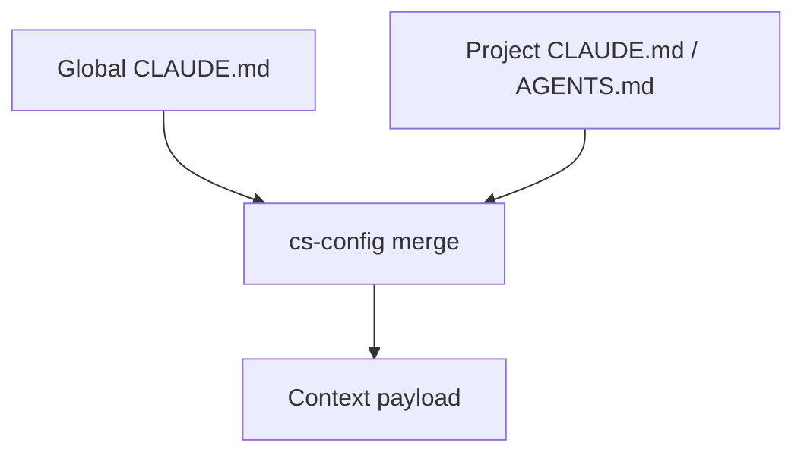
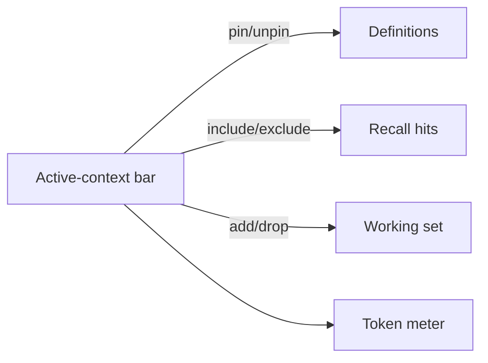

# Context System

ClaudeStudio's context system decides *what Claude knows* on every turn. It layers durable rules (`CLAUDE.md`), reusable knowledge (the Definition Library), and semantic recall into a single, budgeted payload. This doc covers the authoring side; the assembly order and token budget live in [ARCHITECTURE.md](../ARCHITECTURE.md#6-the-6-layer-context-loading-pipeline).

---

## 1. The layers you author

| Layer | File / source | Scope | Who owns it |
| --- | --- | --- | --- |
| **Global memory** | Global `CLAUDE.md` | Every project, every session. | You, once. |
| **Project memory** | Project `CLAUDE.md` / `AGENTS.md` | One project. | The repo. |
| **Cross-project memory** | Distilled vector knowledge | Opt-in, across projects. | The system, from your history. |
| **Definitions** | `.def.md` files | Injected on relevance. | The Definition Library. |

The remaining layers (system identity, semantic recall, live working set) are assembled automatically and described in the architecture doc.

---

## 2. Global & project `CLAUDE.md`

`CLAUDE.md` is the durable instruction file Claude Code already understands. ClaudeStudio manages two tiers:

- **Global `CLAUDE.md`** — your personal, machine-wide preferences and rules. Loaded into **Layer 2** and never trimmed.
- **Project `CLAUDE.md` / `AGENTS.md`** — repo-specific conventions, architecture notes, and guardrails. Loaded into **Layer 3**.

ClaudeStudio gives both a native editor with live preview, validates them, and watches the files on disk (via `cs-config`) so edits take effect on the next turn without a restart.



When both define the same convention, **project memory wins** for that project — local rules override global defaults.

---

## 3. Cross-project memory

Knowledge you build in one project is often useful in another. **Cross-project memory** is an opt-in store of distilled, generalized insights (in the Qdrant `cross_project` collection) that can surface in *any* project's semantic recall.

- It stores **distilled** lessons ("how I handle OAuth refresh", "our preferred test layout"), not raw transcripts.
- It is **opt-in** and respects [privacy mode](memory-and-vector.md#privacy-mode).
- Retrieval is relevance-gated so unrelated projects don't pollute context.

---

## 4. The Definition Library (`.def.md`)

A **definition** is a small, reusable, named unit of knowledge — a domain term, an API contract, a coding convention, a runbook step — written in a `.def.md` file. Definitions live in the `/definitions` folder (see [tasks-and-definitions.md](tasks-and-definitions.md)) and are embedded into the Qdrant `definitions` collection so the most relevant ones are injected per turn (Layer 4).

### `.def.md` format

A `.def.md` file is Markdown with **YAML frontmatter** carrying metadata, followed by the definition body.

```markdown
---
id: jwt-validation
title: JWT Validation Policy
type: convention          # term | convention | contract | runbook | snippet
scope: project            # global | project | cross-project
tags: [auth, security, tokens]
inject: auto              # auto | always | manual
priority: high            # low | medium | high  (affects pruning order)
related: [auth-flow, session-cookie]
version: 1
---

# JWT Validation Policy

All inbound JWTs are validated against the rotating JWKS at `/.well-known/jwks.json`.

- Verify `iss`, `aud`, and `exp`; reject tokens older than 15 minutes.
- Never trust the `alg` header — pin to RS256.
- Validation lives in `cs-claude`'s request guard; do not re-implement per route.
```

### Frontmatter fields

| Field | Purpose |
| --- | --- |
| `id` | Stable identifier; used by `related` and by inject rules. |
| `title` | Human label shown in the library and active-context bar. |
| `type` | What kind of knowledge this is. |
| `scope` | Whether it applies globally, to a project, or cross-project. |
| `tags` | Free-form tags for filtering and retrieval. |
| `inject` | `auto` (relevance-based), `always` (pinned), or `manual` (only on request). |
| `priority` | Drives truncation order in Layer 4 when the budget is tight. |
| `related` | Links to other definitions (also surfaced in the Brain View). |
| `version` | Bump to invalidate stale embeddings. |

---

## 5. Inject mechanisms

Definitions reach a turn through three paths:

| Mode | Behavior |
| --- | --- |
| **`auto`** | The definition is embedded; if it's semantically relevant to the current turn it's injected, lowest-priority first to drop on overflow. |
| **`always`** | Pinned — injected on every turn regardless of relevance (use sparingly; it consumes budget). |
| **`manual`** | Never auto-injected; only pulled in when you explicitly reference it (e.g. via the active-context bar or a slash reference). |

The Supervisor and Agent Teams can also request specific definitions when handing off work (see [agentic-os.md](agentic-os.md#4-agent-to-agent-a2a)).

---

## 6. The active-context bar

A persistent strip in the session panel that shows — and lets you control — exactly what's in context **right now**:

- **Pinned** memory (global + project) and any `always` definitions.
- **Injected** definitions and recall hits for the current turn, with relevance scores.
- **Live working set** — open files, diffs, and the current transcript window.
- A **token meter** showing each layer's share against the budget (see the [budget table](../ARCHITECTURE.md#token-budget-table)).

From the bar you can pin/unpin a definition, force-include or exclude a recall hit, or drop a file from the working set — giving you direct, visible control over context instead of guessing.



---

## See also

- [Memory & Vector](memory-and-vector.md) — how definitions and recall are embedded and retrieved.
- [Tasks & Definitions](tasks-and-definitions.md) — authoring and shipping `.def.md` files.
- [ARCHITECTURE.md](../ARCHITECTURE.md#6-the-6-layer-context-loading-pipeline) — the assembly order and budget.
