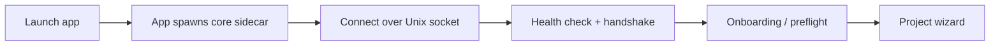

# Getting Started

This guide walks you from zero to a running ClaudeStudio: installing prerequisites, building the Rust core and the macOS app, the first launch, and creating your first project with the wizard.

> **Status.** The build steps below describe the intended developer workflow. Some components are still landing (see [roadmap.md](roadmap.md)); where a step depends on a planned component it is marked **(planned)**.

---

## 1. Prerequisites

ClaudeStudio targets **macOS** (the front-end is native SwiftUI/AppKit).

| Requirement | Version | Notes |
| --- | --- | --- |
| macOS | 14 (Sonoma) or later | Apple Silicon recommended; Intel supported. |
| Xcode | 16+ | The app targets **Swift 6**. Command-Line-Tools-only works for `swift build` but can't run `swift test` (no XCTest). |
| Rust | stable | Install via [rustup](https://rustup.rs); the workspace pins the version via `core/rust-toolchain.toml`. |
| Claude Code CLI | latest | ClaudeStudio drives the official `claude` CLI — it never calls the Anthropic API or injects a key, so a session uses **your CLI login (e.g. a Pro/Max subscription)**. Run `claude /login` first; confirm `claude -p "hi"` works in a terminal. |
| Qdrant | 1.9+ | For semantic memory. Run locally via Docker or the native binary. **(optional at first run)** |
| Ollama or local embed model | latest | Hosts `nomic-embed` for local embeddings. A remote embedding API is the fallback. **(optional)** |

Verify the toolchains:

```bash
rustc --version
cargo --version
xcodebuild -version
claude --version    # the Claude Code CLI
```

---

## 2. Get the source

```bash
git clone https://github.com/vqiz/ClaudeStudio.git
cd ClaudeStudio
```

Repository layout:

```
ClaudeStudio/
├── core/    ← Rust workspace (the sidecar + cs-cli)
├── app/     ← SwiftUI macOS application
├── docs/    ← documentation
├── tasks/   ← shipped task definitions
└── definitions/  ← shipped definition entries
```

---

## 3. Build the Rust core

The core is the brain: it owns state, persistence, the Agentic OS, and every integration. Build it first.

```bash
cd core
cargo build --release
```

This produces `claudestudio-core` (from the `cs-cli` crate) — the sidecar binary
the app talks to. **You normally don't run this yourself: the app starts it
automatically** (and stops it on quit). Run it manually only if you want live
core logs in a terminal:

```bash
cargo run --release -p cs-cli            # binds ~/.claudestudio/core.sock
# during dev, expose the shipped libraries from this checkout:
CLAUDESTUDIO_LIBRARY_DIR="$(cd .. && pwd)" cargo run -p cs-cli
```

Run the test suite to confirm a healthy workspace:

```bash
cargo test --workspace
```

---

## 4. Build & run the macOS app

With the core from step 3 still running in another terminal, pick one:

**A — Xcode (recommended for GUI work).** A real app target with the app icon:

```bash
cd ../app
open ClaudeStudio.xcodeproj     # then press ⌘R to run, ⌘U to test
```

If you ever edit the project layout, regenerate it with
[`XcodeGen`](https://github.com/yonaskolb/XcodeGen): `cd app && xcodegen generate`
(the `project.yml` is the source of truth).

**B — Command line (SwiftPM).** No Xcode project needed:

```bash
cd ../app
swift build              # compile
swift run ClaudeStudio   # launch
```

Either way the app connects to the running core over the local Unix socket at
`~/.claudestudio/core.sock` (see [ARCHITECTURE.md](../ARCHITECTURE.md#4-the-ipc-bridge)).
The title bar shows **Core connected** once the handshake succeeds.

> Tip: `./scripts/dev.sh` from the repo root does steps 3 + 4 (option B) in one
> command. App-managed auto-spawn of the core is still planned.

---

## 5. First run



On first launch ClaudeStudio runs a short **preflight**:

1. **Locate the Claude Code CLI** and confirm it is authenticated.
2. **Choose a trust mode** — defaults to **Standard** (see [security.md](security.md)). You can change it any time.
3. **Optional: connect Qdrant + embeddings** for semantic memory. If you skip this, ClaudeStudio still keeps the full SQLite archive; semantic recall simply turns on later when you connect a vector backend.
4. **Privacy mode** — choose whether conversations are vectorized for recall (see [memory-and-vector.md](memory-and-vector.md#privacy-mode)).

---

## 6. The project wizard

Add your first project to start working. The wizard walks through:

| Step | What it asks | Result |
| --- | --- | --- |
| **1. Source** | Path to an existing repo, or clone a URL. | Project root registered. |
| **2. Worktrees** | Whether to enable git worktrees for parallel branches. | `cs-git` sets up worktree management. |
| **3. Context** | Detects/creates a project `CLAUDE.md` (or `AGENTS.md`). | Project memory layer wired up. |
| **4. Definitions** | Imports any `.def.md` files from `/definitions`. | Definition Library populated. |
| **5. Indexing** | Optionally embed code & docs into Qdrant. | `code_chunks` / `documents` collections seeded. |
| **6. MCP & Hooks** | Detects existing MCP servers and hooks in the repo. | Registered in the MCP and Hooks panels. |

When the wizard finishes you land in the project workspace with a session panel, file/diff views, the Agentic OS view, and the Brain View available from the sidebar.

---

## 7. Your first session

1. Open the **Session** panel.
2. Type a prompt (or use [voice](voice.md)).
3. Watch the response stream token-by-token; tool calls surface as permission prompts according to your trust mode.
4. Every turn is written to the **append-only SQLite archive** and (if enabled) embedded for semantic recall.

---

## Next steps

- [Context System](context-system.md) — set up `CLAUDE.md` and the Definition Library.
- [Agentic OS](agentic-os.md) — turn on monitors and the Supervisor.
- [Agents](agents.md) — design custom agents and teams.
- [Security](security.md) — tune trust modes and permissions.
- [Troubleshooting & FAQ](faq.md).
