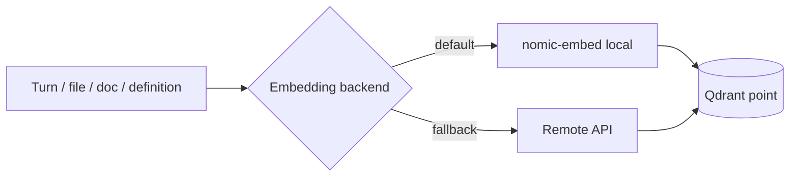
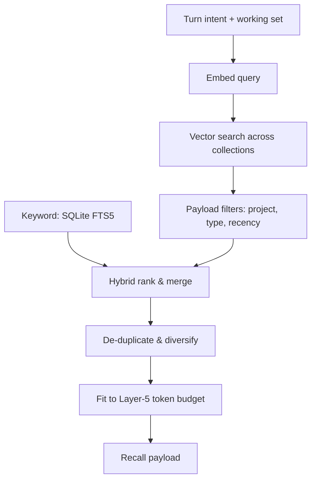

# Memory & Vector

ClaudeStudio gives Claude Code a **permanent semantic memory**. Two stores cooperate: **Qdrant** for vector similarity search and **SQLite (FTS5)** as the durable, append-only archive. This doc covers the collections, embeddings, the retrieval pipeline, the archive's guarantees, and privacy mode. The store lives in the `cs-vector` crate.

---

## 1. Two stores, two jobs

| Store | Role | Guarantee |
| --- | --- | --- |
| **SQLite + FTS5** | Source of truth for all history; keyword search. | Append-only; **never deleted by the app**. |
| **Qdrant** | Semantic similarity / recall. | Re-buildable from the archive at any time. |

The archive is the floor. Vectors sit on top and can be re-embedded, pruned, or rebuilt without ever losing the underlying record.

---

## 2. Qdrant collections

ClaudeStudio uses **five** collections, each tuned to a kind of knowledge.

| # | Collection | Contents | Embedded from |
| --- | --- | --- | --- |
| 1 | `code_chunks` | Source-code chunks, per project. | Repo files, re-indexed on `FileChanged`. |
| 2 | `conversations` | Past session turns (recall over the archive). | SQLite transcript records. |
| 3 | `definitions` | Definition Library entries. | `.def.md` files (see [context-system.md](context-system.md#4-the-definition-library-defmd)). |
| 4 | `documents` | Project docs, specs, READMEs, references. | Markdown/text docs in the project. |
| 5 | `cross_project` | Distilled, opt-in knowledge shared across projects. | Summarized insights from all projects. |

Each point carries a payload (project id, source path, timestamp, type, tags) so retrieval can filter before ranking.

---

## 3. Embeddings

| Tier | Backend | When used |
| --- | --- | --- |
| **Local (default)** | `nomic-embed` via a local runtime (e.g. Ollama). | Default — keeps embeddings on-device. |
| **Fallback** | A configured remote embedding API. | Only if local is unavailable or explicitly chosen. |

- The model and dimensionality are recorded per point; bumping a definition's `version` or changing the model triggers re-embedding.
- Local-first is a deliberate privacy choice: with the default backend, your code and conversations are never sent to a third party just to be embedded.

---

## 4. The retrieval pipeline

Before a turn, `cs-vector` builds the recall portion of context (Layer 5 of the [context pipeline](../ARCHITECTURE.md#6-the-6-layer-context-loading-pipeline)):

1. **Embed the query** (intent + active working set).
2. **Vector search** across the relevant collections (always the project's; `cross_project` only if opted in).
3. **Keyword search** via FTS5 in parallel for exact-match recall (hybrid retrieval).
4. **Filter** by payload (project, type, recency).
5. **Rank & merge** vector and keyword hits; **de-duplicate** and diversify so one file doesn't dominate.
6. **Fit** to the Layer-5 token budget — `k` shrinks to fit.

The result is surfaced with relevance scores in the [active-context bar](context-system.md#6-the-active-context-bar) so you can see and override what was recalled.

---

## 5. SQLite archive guarantees

The archive is what makes the memory *permanent*.

| Guarantee | Detail |
| --- | --- |
| **Append-only** | New sessions, turns, events, tool calls, and cost records are inserted, not overwritten. |
| **Never deleted by the app** | ClaudeStudio does not delete archive rows. Pruning, if ever offered, is an explicit, user-driven action — never automatic. |
| **Full-text searchable** | FTS5 indexes power instant keyword search across all history. |
| **Re-embeddable** | Vectors can be rebuilt entirely from the archive, so a Qdrant reset loses nothing permanent. |
| **Local** | The archive is a local file under the app's container; it never leaves the machine. |

This is why semantic recall is safe to experiment with: the worst case for the vector layer is a rebuild, never data loss.

---

## 6. Privacy mode

Privacy mode controls how much of your activity becomes searchable memory. It is chosen at onboarding and changeable any time.

| Mode | Archive (SQLite) | Vectorization (Qdrant) | Cross-project | Embedding backend |
| --- | --- | --- | --- | --- |
| **Full memory** | Yes | Yes | Opt-in | Local default, remote fallback |
| **Local-only** | Yes | Yes | Off | Local only — remote fallback disabled |
| **Archive-only** | Yes | Off | Off | None |
| **Ephemeral** | Off | Off | Off | None |

- **Full memory** — the richest experience: everything is archived and embedded; cross-project recall available if you opt in.
- **Local-only** — embeddings never leave the device (remote fallback is disabled).
- **Archive-only** — keep durable history and keyword search, but no semantic recall.
- **Ephemeral** — nothing is persisted beyond the live session.

Privacy mode is enforced in the core (`cs-vector` + `cs-config`), so it holds for headless/CLI and remote runs too — not just the UI.

---

## See also

- [Context System](context-system.md) — how recalled knowledge is injected into a turn.
- [Brain View](brain-view.md) — visualizing the memory graph.
- [Security](security.md) — secret scanning before anything is stored or embedded.
- [ARCHITECTURE.md](../ARCHITECTURE.md#5-data-layer) — the data layer in context.
