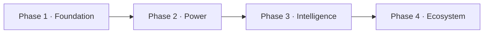

# Roadmap

ClaudeStudio is built in four phases. Each phase is a coherent, shippable layer that the next builds on. Checkboxes reflect intended scope; this is a living document and an honest statement of direction, not a delivery guarantee. See [faq.md](faq.md) for the current state.

> Legend: `[ ]` planned · `[~]` in progress · `[x]` implemented. Most items are early-stage; treat unchecked boxes as forward-looking.

---

## Phase 1 — Foundation

*Goal: a rock-solid native shell that drives Claude Code, with durable history.*

- [~] Two-process architecture: SwiftUI app + Rust core sidecar
- [~] IPC bridge — Unix socket + MessagePack ([ARCHITECTURE.md](../ARCHITECTURE.md#4-the-ipc-bridge))
- [~] Foundational crates: `cs-types`, `cs-ipc`, `cs-config`
- [~] Session lifecycle (`cs-sessions`): spawn, PTY/terminal, transcript capture, resume
- [~] Claude Code integration (`cs-claude`): invocation, plan mode, permissions
- [~] Git integration (`cs-git`): worktrees, branches, diffs, commits
- [~] SQLite (FTS5) append-only archive — never-deleted history
- [~] Project wizard & navigation shell
- [ ] Trust modes + critical gates (baseline security)

## Phase 2 — Power

*Goal: turn the shell into a serious power-user tool.*

- [ ] Definition Library (`.def.md`) + 6-layer context assembly ([context-system.md](context-system.md))
- [ ] Global & project `CLAUDE.md` / `AGENTS.md` management
- [ ] MCP server lifecycle & catalog (`cs-mcp`); plugin registry
- [ ] Hooks (`cs-hooks`): registry + execution; secret scanner; prompt-injection guard
- [ ] Granular permissions + audit log ([security.md](security.md))
- [ ] Task Library (`/tasks`, `.task.json`) + 6-tab builder ([tasks-and-definitions.md](tasks-and-definitions.md))
- [ ] Cost/telemetry view (`cs-otel`): tokens, cost, latency, traces
- [ ] Git/deploy hooks & pipelines

## Phase 3 — Intelligence

*Goal: permanent memory and autonomy.*

- [ ] Vector memory (`cs-vector`): Qdrant 5 collections + `nomic-embed` local embeddings ([memory-and-vector.md](memory-and-vector.md))
- [ ] Hybrid retrieval pipeline (vector + FTS5) and privacy mode
- [ ] Cross-project memory (opt-in)
- [ ] Agentic OS (`cs-agentic-os`): Supervisor, Event-Bus, scheduler/priority queue ([agentic-os.md](agentic-os.md))
- [ ] Agent-to-Agent (A2A) + Agent Teams (orchestrator/workers) ([agents.md](agents.md))
- [ ] Continuous-monitor agents + OS View mission control
- [ ] Model Router + fallback chains
- [ ] Voice assistant: wake-word/STT/TTS pipeline ([voice.md](voice.md))
- [ ] Brain View knowledge graph ([brain-view.md](brain-view.md))

## Phase 4 — Ecosystem

*Goal: open it up — to other machines, teams, and the community.*

- [ ] Agent Studio sharing & versioning; community agent/task/definition packs
- [ ] DE/AT compliance pack (and a template for other jurisdictions)
- [ ] Visual rule editor for the Supervisor ([agentic-os.md](agentic-os.md#8-the-visual-rule-editor))
- [ ] Remote execution over SSH (`cs-ssh`)
- [ ] Headless `cs-cli` for scripting & CI
- [ ] Team sharing of memory/definitions (with privacy controls)
- [ ] Marketplace/registry for plugins, MCP servers, agents, and tasks

---

## Dependency flow

Each phase is usable on its own: Phase 1 is a great native Claude Code GUI; Phase 2 makes it a power tool; Phase 3 adds memory and autonomy; Phase 4 opens the ecosystem.

---

## See also

- [FAQ](faq.md) — what's ready today, honestly.
- [ARCHITECTURE.md](../ARCHITECTURE.md) — the design these phases realize.
- [Contributing](faq.md#how-can-i-contribute) — where help is most welcome.
