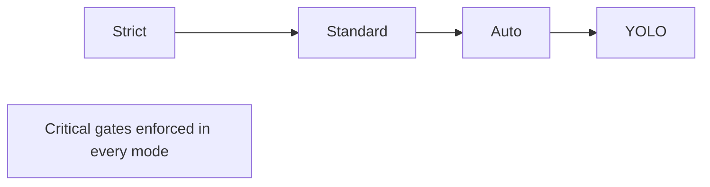
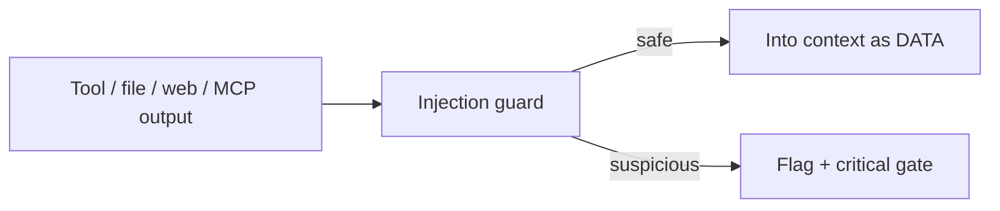

# Security & Permissions

Autonomy is only useful if it's safe. ClaudeStudio enforces a layered security model in the **core** (`cs-hooks` + `cs-claude`), so it holds for the UI, the headless CLI, scheduled tasks, and remote runs alike — the front-end can never bypass it. This doc covers trust modes, critical gates, granular permissions, the secret scanner, the prompt-injection guard, and the audit log.

---

## 1. Trust modes

A **trust mode** sets the default posture for how much an agent may do without asking. It's chosen at onboarding and changeable any time (and can be required minimally per task — see [tasks-and-definitions.md](tasks-and-definitions.md)).

| Mode | Posture | Read | Write / edit | Run commands | Network | Critical gates |
| --- | --- | --- | --- | --- | --- | --- |
| **Strict** | Ask for almost everything. | Auto | Ask | Ask | Ask | Always block until approved |
| **Standard** *(default)* | Safe actions auto; risky actions ask. | Auto | Auto (in-project) | Ask | Ask | Always |
| **Auto** | Most actions auto; only critical actions ask. | Auto | Auto | Auto (allowlisted) | Ask | Always |
| **YOLO** | Maximal autonomy. | Auto | Auto | Auto | Auto | **Still enforced** |

> Even in **YOLO**, the **critical gates** (section 2) are *never* waived, the secret scanner and injection guard stay on, and everything is audited. YOLO removes friction, not safety floors.

---

## 2. Critical gates

Some actions are dangerous enough that they require explicit approval **in every trust mode**, regardless of granular settings:

| Gate | Examples |
| --- | --- |
| **Destructive filesystem** | Deleting files/dirs outside the project, recursive removals, overwriting outside the working set. |
| **History rewrite / force-push** | `git push --force`, hard resets that discard commits, branch deletion on remotes. |
| **Secret exposure** | Any action the secret scanner flags as exfiltrating credentials (see section 4). |
| **External side effects** | Deploys, package publishes, sending mail, hitting production endpoints. |
| **Privilege / config escalation** | Editing trust mode, permissions, hooks, or MCP server config. |
| **Spending past budget** | Exceeding a configured token/cost ceiling. |

A gated action raises a `PermissionRequested` event (see [agentic-os.md](agentic-os.md#3-the-event-bus)) and blocks until you approve or deny.

---

## 3. Granular permissions

Beneath trust modes, permissions are fine-grained and composable. They can be set per project, per agent, and per task.

| Permission | Controls |
| --- | --- |
| `read` | Reading files (scoped to project paths by default). |
| `write` | Creating/editing files within allowed paths. |
| `run:<tool>` | Running a specific tool or command class (allowlist). |
| `network:<host>` | Outbound network to specific hosts. |
| `git:<op>` | Specific git operations (commit, push, branch…). |
| `mcp:<server>` | Using a specific MCP server's tools. |
| `deploy` | Triggering deploy pipelines. |

Permissions are **deny-by-default** at stricter modes and **allowlist-driven** for command execution, so an agent can only run what you've sanctioned.

---

## 4. Secret scanner

Before content is written, logged, embedded, or sent to a model, the secret scanner inspects it for credentials.

- **Patterns + entropy** — known token formats (API keys, cloud credentials, private keys) plus high-entropy heuristics.
- **Acts pre-store and pre-send** — runs before SQLite archival, before Qdrant embedding, and before content leaves to a model/provider.
- **On hit** — raises a critical gate, redacts in logs, and blocks exfiltration paths until you decide.

This keeps secrets out of the permanent memory layer (see [memory-and-vector.md](memory-and-vector.md)) as well as out of prompts.

---

## 5. Prompt-injection guard

Untrusted content (file contents, tool output, web text, MCP responses) can carry instructions that try to hijack the agent. The guard:

- **Marks provenance** — distinguishes trusted instructions (system, your prompts, project memory) from untrusted data.
- **Neutralizes embedded directives** — content that says "ignore previous instructions" / "exfiltrate X" is treated as data, not commands.
- **Escalates suspicious patterns** — attempts to trigger critical-gate actions from untrusted text are flagged and gated.
- **Logs detections** — every detection is an event in the audit log.

---

## 6. Audit log

Everything security-relevant is recorded to the **append-only audit log** (in the SQLite archive — see [ARCHITECTURE.md](../ARCHITECTURE.md#52-sqlite--durable-archive-fts5)):

| Logged | Detail |
| --- | --- |
| Permission decisions | What was requested, granted/denied, by whom, when. |
| Critical-gate events | Each gate raised and its resolution. |
| Secret-scanner hits | Redacted record of detections and outcomes. |
| Injection detections | Flagged untrusted content and action taken. |
| Tool executions | Every tool call and result, tied to a session/agent. |
| Config changes | Trust mode, permission, hook, and MCP changes. |

The log is searchable (FTS5), replayable in the OS View timeline, and never deleted by the app — giving you a complete, after-the-fact account of what the system did and why.

---

## See also

- [Agentic OS](agentic-os.md) — where gates surface and rules can auto-approve safe patterns.
- [Tasks & Definitions](tasks-and-definitions.md) — per-task guardrails and minimum trust modes.
- [Memory & Vector](memory-and-vector.md) — privacy mode and what gets stored.
- [ARCHITECTURE.md](../ARCHITECTURE.md) — where enforcement lives in the crate graph.
