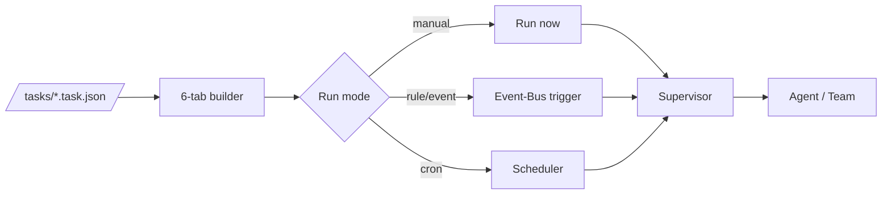

# Tasks & Definitions

ClaudeStudio ships two libraries of reusable, version-controlled knowledge:

- The **Task Library** (`/tasks`) — reusable, parameterized units of work described by `.task.json` files.
- The **Definition Library** (`/definitions`) — reusable knowledge described by `.def.md` files.

Definitions feed the [context system](context-system.md); tasks feed the [Agentic OS](agentic-os.md) scheduler. This doc covers tasks in depth and cross-links definitions.

> **Status.** The Task Library and the 6-tab builder are Phase 2 (Power) features; the DE/AT compliance pack is a curated content bundle that ships on top. See [roadmap.md](roadmap.md).

---

## 1. The Task Library concept

A **task** is a named, reusable workflow: a goal, the agent/team that runs it, its inputs, its guardrails, and (optionally) a schedule. Tasks are stored as `.task.json` files in the `/tasks` folder so they're versionable, shareable, and reviewable like any other repo artifact.

Tasks are the unit the Supervisor schedules. A task can be run on demand, triggered by a rule/event, or run on a cron schedule.



---

## 2. `.task.json` structure

```jsonc
{
  "id": "weekly-dependency-audit",
  "title": "Weekly Dependency Audit",
  "description": "Check for outdated and vulnerable dependencies and open a summary.",
  "version": 1,

  "agent": "dependency-auditor",        // an agent or team id (see agents.md)
  "inputs": {
    "manifestPath": "package.json",
    "severityThreshold": "moderate"
  },

  "context": {                          // which knowledge to inject
    "definitions": ["dependency-policy"],
    "collections": ["code_chunks", "documents"]
  },

  "guardrails": {
    "trustMode": "standard",            // minimum trust mode required
    "permissions": ["read", "run:audit-tools"],
    "budget": { "maxTokens": 40000, "maxCostUsd": 0.50 }
  },

  "schedule": {                         // optional
    "cron": "0 9 * * MON",
    "timezone": "Europe/Vienna"
  },

  "outputs": {
    "type": "report",                   // report | diff | structured
    "notify": ["os-view", "push"]
  },

  "tags": ["maintenance", "security"]
}
```

| Field | Purpose |
| --- | --- |
| `id` / `title` / `description` / `version` | Identity and metadata. |
| `agent` | The agent or team that executes the task. |
| `inputs` | Parameters passed to the agent. |
| `context` | Definitions and collections to inject (see [context-system.md](context-system.md)). |
| `guardrails` | Minimum trust mode, permissions, and budget (see [security.md](security.md)). |
| `schedule` | Optional cron + timezone for recurring runs. |
| `outputs` | Result shape and where to surface/notify. |
| `tags` | Filtering and grouping in the library. |

---

## 3. The 6-tab builder

The visual task builder organizes authoring into six tabs:

| # | Tab | What you configure |
| --- | --- | --- |
| 1 | **Overview** | `id`, `title`, `description`, `tags`. |
| 2 | **Agent** | Which agent/team runs it (see [agents.md](agents.md)). |
| 3 | **Inputs** | Declared parameters and their defaults. |
| 4 | **Context** | Definitions to inject and collections to query. |
| 5 | **Guardrails** | Trust mode, permissions, and budget ceilings. |
| 6 | **Schedule & Output** | Cron/trigger and where results are delivered. |

The builder reads and writes the same `.task.json` on disk, so visual edits stay in sync with the file and remain diffable in git.

---

## 4. Scheduling

Tasks can run three ways, all coordinated by the Agentic OS scheduler/priority queue (see [agentic-os.md](agentic-os.md#5-scheduler--priority-queue)):

| Mode | Trigger | Example |
| --- | --- | --- |
| **Manual** | You run it. | "Run the dependency audit now." |
| **Event** | An Event-Bus rule fires it. | On push to `main`, run the review task. |
| **Cron** | A time schedule. | Every Monday 09:00, run the weekly audit. |

Scheduled tasks respect budgets and trust modes at admission time — the queue won't run a task whose guardrails the current state can't satisfy.

---

## 5. The DE/AT compliance pack

A curated bundle of tasks and definitions for **German (DE)** and **Austrian (AT)** legal/compliance workflows — useful for teams that must satisfy DSGVO/GDPR and regional requirements.

The pack ships:

- **Definitions** (`/definitions`) — DSGVO/GDPR principles, data-subject-rights handling, retention rules, and regional conventions, as `.def.md` entries that inject into relevant work.
- **Tasks** (`/tasks`) — e.g. a privacy/DPIA-style review task, a data-handling audit, and a documentation-generation task, as `.task.json` definitions.

The pack is content layered on the same task/definition machinery — no special engine — so you can fork, extend, or localize it for other jurisdictions.

> Compliance tasks assist with documentation and review; they are not a substitute for legal advice.

---

## 6. Cross-link: the `/tasks` and `/definitions` folders

```
ClaudeStudio/
├── tasks/          ← .task.json files (this doc, sections 2–5)
│   ├── weekly-dependency-audit.task.json
│   └── de-at-compliance/…
└── definitions/    ← .def.md files (see context-system.md)
    ├── dependency-policy.def.md
    └── de-at-compliance/…
```

- The **`/definitions`** folder and the `.def.md` format are documented in [context-system.md](context-system.md#4-the-definition-library-defmd); entries are embedded into the Qdrant `definitions` collection.
- The **`/tasks`** folder holds the `.task.json` files described above; both folders are plain repo files, so they version, review, and share like code.

---

## See also

- [Context System](context-system.md) — the `.def.md` format and injection.
- [Agentic OS](agentic-os.md) — how tasks are scheduled and triggered.
- [Agents](agents.md) — the agents/teams tasks invoke.
- [Security](security.md) — the guardrails tasks must satisfy.
